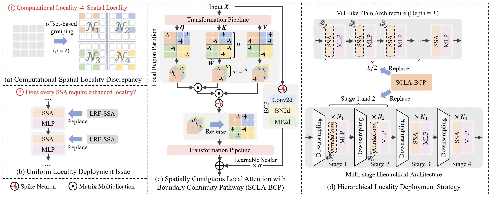
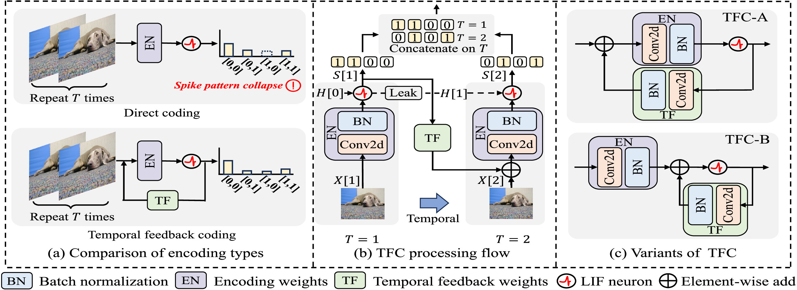
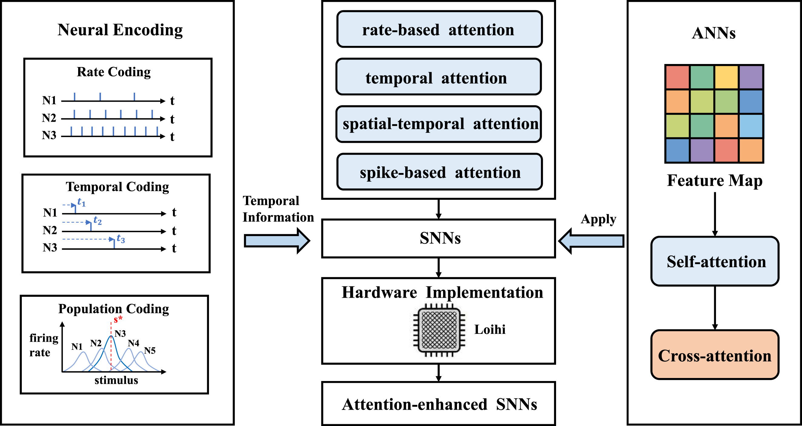








I am currently a Ph.D. student in the Joint Ph.D. Program between Zhejiang University and Westlake University (enrolled in the Fall of 2024). I conduct my research at the [School of Engineering](https://en-soe.westlake.edu.cn/), [Westlake University](https://en.westlake.edu.cn/), where I am privileged to be supervised by Prof. [Yaochu Jin](https://scholar.google.com/citations?user=B5WAkz4AAAAJ&hl=en).

My research focuses on Brain-inspired Computing, specifically enhancing the performance of Spiking Neural Networks (SNNs) to tackle increasingly complex tasks. I am passionate about bridging the gap between biological efficiency and artificial intelligence.

I am always open to collaborations or discussions regarding SNNs and neuromorphic computing. Feel free to reach out—let’s connect!

# Educations
- *2019.09 - 2023.06*, B.E. in Computer Science and Technology (East China University of Science and Technology)
- *2023.09 - 2024.06*, M.S. in Computer Science and Technology (East China University of Science and Technology, Withdrawn)
- *2024.09 - 2029.06 (Expected)*, Ph.D. Student in Computer Science and Technology (School of Computer Science, Zhejiang University).

# News

- *2026.07*: &nbsp;🎉🎉 One paper on temporal modeling in Spiking Transformers was accepted for publication in **Neural Networks**!

- *2026.07*: &nbsp;🎉🎉 One review paper on attention mechanisms in SNNs was accepted for publication in **Journal of Automation and Intelligence**!

- *2026.05*: &nbsp;🎉🎉 One paper on mitigating visual hallucinations in MLLMs was accepted to **ICML 2026**!

- *2025.06*: &nbsp;🎉🎉 One paper on SNNs for Image Classification was accepted by **ICCV-2025**!

# Publications

## Brain-Inspired Computing

Arxiv(2608.08541)

Rethinking Attention Locality in Spiking Transformers \\
**Zeqi Zheng**, Zizheng Zhu, Yuping Yan, et al.
- Rethinks attention locality in Spiking Transformers, revealing that computational locality does not necessarily translate into spatial locality and that uniform locality enhancement overlooks architectural differences, motivating an architecture-aware locality design.
- 

Neural Networks

Enhancing Spiking Transformers with Temporal Feedback Coding and Global-Local Dynamic Neurons \\
**Zeqi Zheng**, Zizheng Zhu, Yingchao Yu, et al.
- TFC and GLD-LIF jointly enhance spike pattern diversity and temporal modeling in Spiking Transformers, achieving consistent performance gains with limited computational overhead.
- 

Journal of Automation and Intelligence

  
Attention mechanisms in Spiking Neural Networks: From neural encoding to hardware implementation \\
Doudou Wu\*, **Zeqi Zheng\***, Yaochu Jin†
- This survey systematically reviews attention mechanisms in SNNs, spanning neural encoding, algorithmic design, and neuromorphic hardware implementation, while highlighting key challenges and future directions.
- 

ICCV-2025 (Poster)

  
SpiLiFormer: Enhancing Spiking Transformers with Lateral Inhibition \\
**Zeqi Zheng**\*, Yancheng Huang\*, Yingchao Yu, et al.
- SpiLiFormer incorporates brain-inspired lateral inhibition to mitigate attention distraction in Spiking Transformers, achieving SOTA performance.
-  \| 

Arxiv(2505.15840)

  
TDFormer: A Top-Down Attention-Controlled Spiking Transformer \\
Zizheng Zhu\*, Yingchao Yu\*, **Zeqi Zheng\***, et al.
- TDFormer introduces top-down attention to Spiking Transformers, enhancing temporal information integration with SOTA performance.
- 

## Others

-  Spinal-inspired Artificial Tactile Interneuron with High-order Burst Spiking for Intelligent Edge Interfaces
  Fanfan Li, Zhanglu Yan, Jiayi Mao, Guolei Liu, Huihui Ren, Bangbang Qin, Zhongfang Zhang, Haiyue Zhang, Yiyang Shen, **Zeqi Zheng**, Weilong Feng, Dingwei Li, Yingjie Tang, Saisai Wang, Yaochu Jin, Tao Luo, Weng-fai Wong, Hong Wang, Bowen Zhu
  

-  Mitigating Visual Hallucinations via Semantic Curriculum Preference Optimization in MLLMs
  Yuanshuai Li, Yuping Yan, Junfeng Tang, Yunxuan Li, **Zeqi Zheng**, Yaochu Jin
  

-  Sparse Autoencoders Bridge The Deep Learning Model and The Brain
  Ziming Mao, Jia Xu, **Zeqi Zheng**, Haofang Zheng, Dabing Sheng, Yaochu Jin, Guoyuan Yang
  

-  Think Small, Plan Smart: Minimalist Symbolic Abstraction and Heuristic Subspace Search for LLM-Guided Task Planning
  Junfeng Tang, Yuping Yan, Zihan Ye, Zhenshou, Song, **Zeqi Zheng**, Yaochu Jin
  

-  A Personalized Federated Framework for Document-Level Biomedical Relation Extraction
  Yan Xiao, Yaochu Jin, Haoyu Zhang, Xu Huo, Qiqi Liu, **Zeqi Zheng**
  

-  Federated Graph Neural Networks with Bipartite Embedding for Multi-objective Facility Location
  **Zeqi Zheng**, Ziqi Wang, Xueming Yan, Yaochu Jin, Shiqing Liu, Qiqi Liu
  

-  Multi-medvit: A Deep Learning Approach for the Diagnosis of COVID-19 with the CT Images
  Yunjie Cai, **Zeqi Zheng**, Shanling Nie, Yue Guo, Ruijie Zhang, Hai Yang
  

# Academic Services
- **Conference Reviewer:** AAAI 2026, ACM-MM 2026, AAAI 2027
- **Journal Reviewer:** Complex & Intelligent Systems, IEEE Transactions on Cognitive and Developmental Systems

# Honors and Awards
- *2023* Best Student Paper Award (DOCS 2023)
- *2019-2023* School Academic Scholarship (First & Second Prize)

# Welcome

